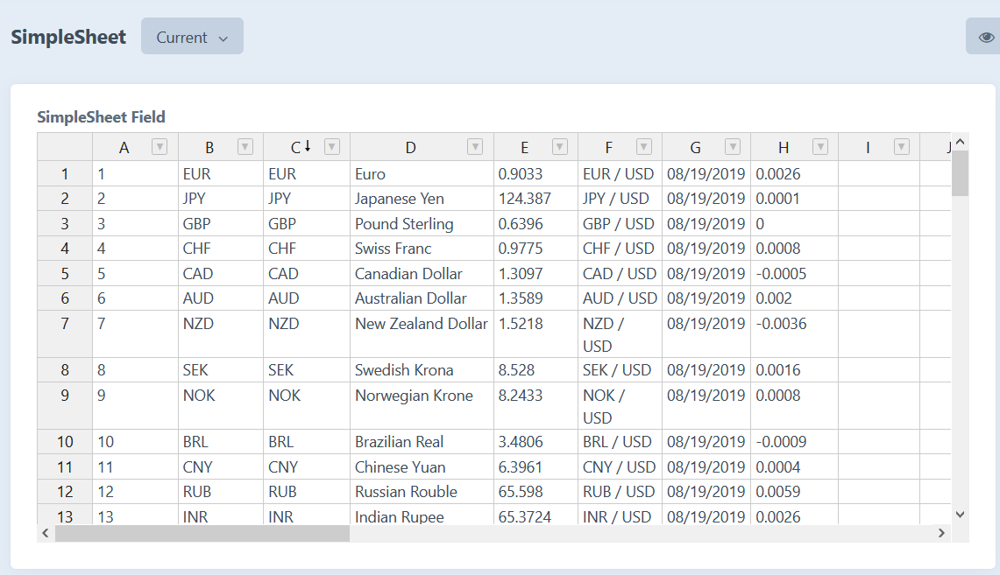

# SimpleSheet plugin for Craft CMS 3.x

Provides an additional Spreadsheet Field Type for Craft CMS.

## TODO ##

- Remove unnecessary references, attributes, etc from code

## Requirements

This plugin requires Craft CMS 3.0.0-beta.23 or later.

SimpleSheets utilizes a non-commercial instance of [Handsontable](https://handsontable.com) via CDN to render spreadsheets. You can find a copy of the Handsontable license online [here](https://handsontable.com/static/licenses/non-commercial/v2/handsontable-non-commercial-license.pdf).

## Installation

To install the plugin, follow these instructions.

1. Open your terminal and go to your Craft project:

        cd /path/to/project

2. Then tell Composer to load the plugin:

        composer require /simple-sheet

3. In the Control Panel, go to Settings → Plugins and click the “Install” button for SimpleSheet.

## SimpleSheet Overview

SimpleSheet brings basic spreadsheet functionality with a familiar interface to Craft CMS.

## Configuring SimpleSheet

Once the SimpleSheet plugin is successfully installed, it is ready to go.

## Using SimpleSheet

### Creating a SimpleSheet field

You can create a SimpleSheet field in the same way as you would any other field in Craft.
- In the Control Panel, go to "Settings" -> "Fields" and click the "New Field" button.
- Fill out the required fields and select "SimpleSheet" from the "Field Type" dropdown.

You may now add this new field to your sections.

### Adding data

When using a SimpleSheet field in the Entries page, the following actions are available:

- Inserting/Deleting rows and columns
- Duplicating data
- Sorting data
- Rearranging row and column order
- Filtering
- Keyboard navigation
- Copying from Excel and Google Sheets

Currently, only the following actions affect the underlying spreadsheet data and will be saved between view states:
- Inserting/Deleting rows and columns
- Duplicating data
- Rearranging row and column order
- Copying from Excel and Google Sheets

#### Inserting and Deleting rows and columns

Right-click on the sheet to bring up the context-menu. The following options will be be available:
- Insert row above
- Insert row below
- Insert column left
- Insert column right
- Remove rows
- Remove columns

#### Duplicating data

Data can currently be duplicated through the following steps:

1. Selected the desired row or column to duplicate.
2. Select "copy" from the context menu, or use native keyboard shortcuts (Ctrl+C / Cmd+C)
3. Open the context menu and insert a new row or column.
4. Select the first cell of the newly-created row or column.
5. Use keyboard shortcuts to paste the data (Ctrl+V / Cmd+V)

#### Sorting Data

Data can be sorted by clicking on the header text of the column. A small arrow will appear in the header to indicate that the spreadsheet data is being sorted by that particular column, and whether the data is being sorted in ascending or descending order.

#### Rearranging row and column order

Rows and columns can be rearranged by dragging and dropping them into a new order. A small hand cursor will appear on the selected row/column header to indicate that the element can be dragged. Note that the row/column must be selected for this cursor to appear.
 - For rows, the cursor appears at the top of the selected row header.
 - For columns, the cursor appears on the left edge of the selected column header.

#### Filtering

Data filtering is available through a dropdown button on the right side of each column. The following filter options are available:
- Filter by predefined conditions:
        - Is/Is Not Empty
        - Is/Is Not Equal To
        - Begins/Ends With
        - Contains/Does Not Contain
- Filter by value (freeform text)
- Manual filter (select/deselect specific values from a list of checkboxes)

#### Keyboard navigation

Basic keyboard navigation is supported:
1. **Tab** moves the current cell focus right.
2. **Shift+Tab** moves the current cell focus left.
3. **Enter/Return**
        - On first keypress, will enter the top leftmost selected cell for editing.
        - On second keypress, will commit any changes and move down one cell.
4. **Directional keys** moves the current cell focus in the direction pressed.

#### Copying from Excel and Google Sheets

Data can be copied from Excel/Google Sheets and pasted into the spreadsheet using standard keyboard shortcuts
To Copy: **Ctrl+C** on Windows/Linux, **Cmd+C** on MacOS.
To Paste: **Ctrl+V** on Windows/Linux, **Cmd+V** on MacOS.

Note that formatting and styling features are currently not supported and will not carry over into the SimpleSheet field.

### Displaying the SimpleSheet

Rendering a non-editable version of your spreadsheet in the frontend is a simple matter of using the `embed` method on your SimpleSheet field. This will return a div container tag with your provided (or auto-generated ID), and will include the JS and CSS required to render the spreadsheet.

        {{ mySimpleSheetField.embed() }}

Embed accepts an optional `options` object as its only parameter. You may use this to pass an `id` string, which will be used to create the SimpleSheet container in HTML and referenced by JavaScript.

        {{ mySimpleSheetField.embed({
                id: 'sheet',
        }) }}

## SimpleSheet Roadmap

This plugin is currently in its early stages and has limited functionality. Features planned for future versions:
* Support for non-volatile display settings (text alignment, column width, etc), allowing these settings to persist between views and apply to the frontend.
* Conditional formatting.
* Apply background colours to cells.
* Apply simple borders to cells.
* Define data types of cells (text, numeric, decimal, etc)
* Support for basic formulas (average, sum, etc)
